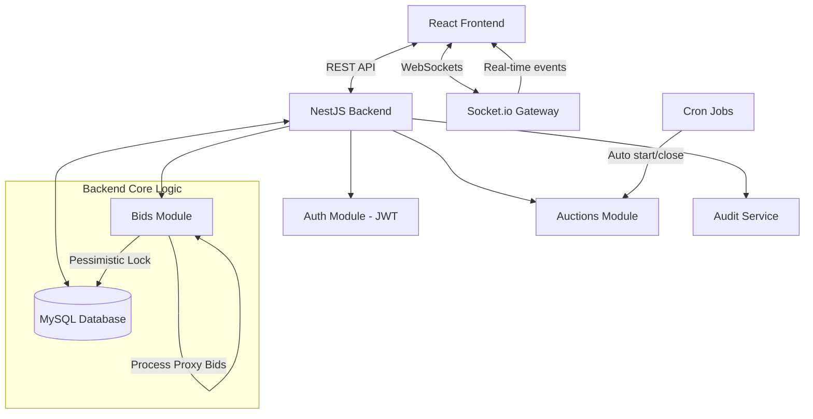
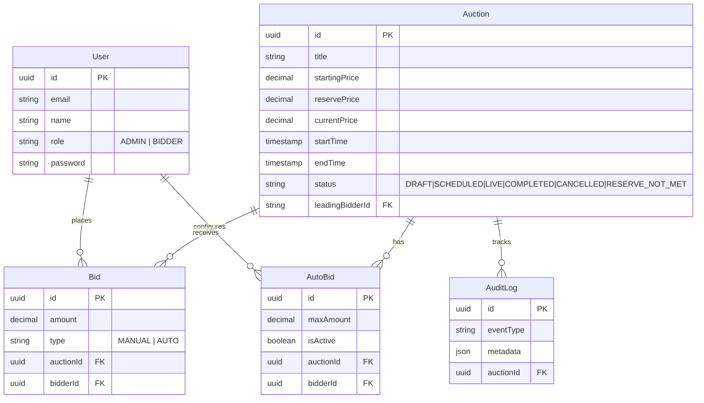

# Real-Time Auction Platform

A comprehensive, scalable, real-time auction platform built with NestJS (Backend), React (Frontend), and MySQL (Database).

## Overview

This platform enables multiple users to participate in live auctions simultaneously, featuring dynamic bid increments, anti-sniping rules, proxy/auto-bidding, and secure transaction handling.

## Architecture Diagram



## Database ER Diagram



## Core Technical Decisions

### 1. Concurrency and Race Conditions
- **Pessimistic Locking (`SELECT FOR UPDATE`)**: Used extensively when processing bids and closing auctions. Only one database transaction can hold the lock for a given auction at a time. This guarantees that concurrent bids are serialized at the database level, preventing issues like two users outbidding the same price simultaneously.
- **Idempotency Keys**: Bid placement accepts an idempotency key to prevent accidental duplicate requests from double-charging or failing incorrectly.

### 2. Automatic (Proxy) Bidding
- Auto-bidding is processed in the same transactional context but deferred to `process.nextTick` to unblock the current request.
- The algorithm evaluates the active auto-bids. If a user sets a max amount higher than competitors, the system bids only the *minimum increment* required to beat the competitor's max limit.

### 3. Real-Time Updates
- Uses **Socket.io** (`@nestjs/websockets`).
- Clients join rooms (e.g., `auction:123`) to only receive events for the auctions they are actively viewing.
- Events triggered: `bid-placed`, `auction-extended` (anti-sniping), `auction-ended`, `auction-started`.

### 4. Auction Closing / Scheduler
- **Cron Jobs**: A background scheduler (`@nestjs/schedule`) polls the database every 15-30 seconds to transition `SCHEDULED -> LIVE` and `LIVE -> COMPLETED`.
- **Idempotent Closing**: The `closeAuction` method uses a locking mechanism and an `isClosing` flag to ensure that even if the scheduler runs concurrently with a manual trigger, the auction is only closed and evaluated once.

## Setup Instructions

### Prerequisites
- Node.js (v18 or v22)
- MySQL Database

### 1. Backend Setup
1. Open a terminal and navigate to the backend directory:
   ```bash
   cd auction-backend
   ```
2. Install dependencies:
   ```bash
   npm install --legacy-peer-deps
   ```
3. Configure the environment variables:
   Copy `.env.example` to `.env` and update your MySQL connection details.
   ```bash
   cp .env.example .env
   ```
4. Start the backend development server:
   ```bash
   npm run start:dev
   ```

### 2. Frontend Setup
1. Open a new terminal and navigate to the frontend directory:
   ```bash
   cd auction-frontend
   ```
2. Install dependencies:
   ```bash
   npm install --legacy-peer-deps
   ```
3. Start the React development server:
   ```bash
   npm run dev
   ```

### 3. Testing
Automated tests are implemented using Vitest.
```bash
cd auction-backend
npm run test
```

## API Documentation

- `POST /api/auth/register` - Register a new user (role: 'bidder' or 'admin')
- `POST /api/auth/login` - Authenticate and receive JWT token
- `POST /api/auctions` - Create an auction (Admin only)
- `GET /api/auctions` - List auctions
- `POST /api/auctions/:id/bids` - Place a bid (auth required)
- `POST /api/auctions/:id/bids/auto` - Configure max proxy bid amount
- `GET /api/auctions/:id/bids` - Get live bid history
