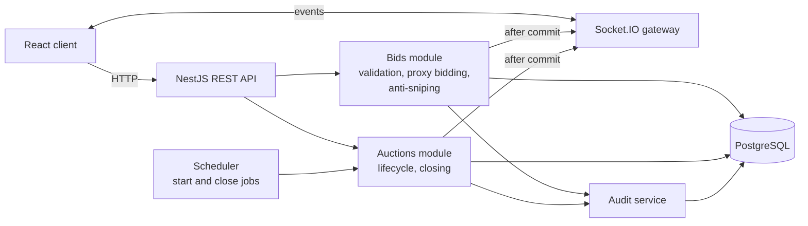
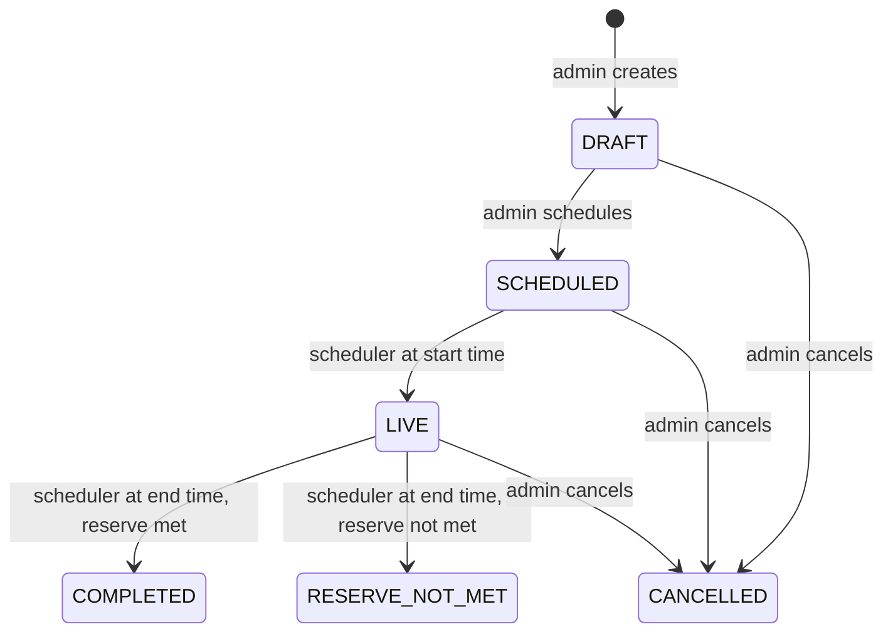
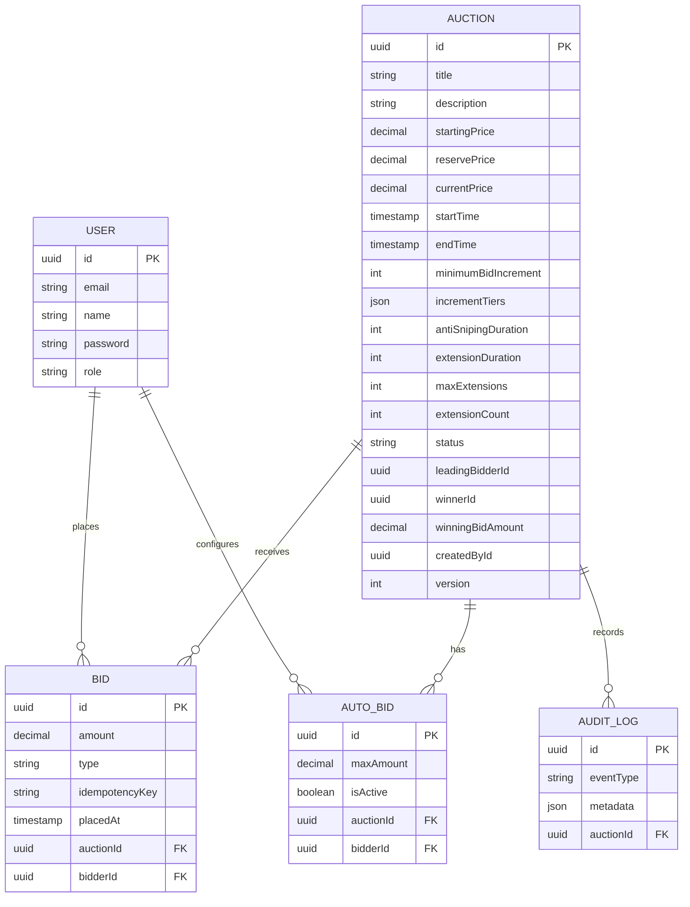

# BidFlow

BidFlow is a real-time auction platform where multiple bidders compete in live auctions at the same time. The backend is the single source of truth for every bid: it validates amounts, resolves automatic (proxy) bidding, extends auctions near their end, closes them safely, and pushes every change to connected clients over WebSockets.

It was built for the Associate Software Engineer technical assignment. The focus is correctness of the auction logic and safe concurrent bidding, rather than the number of screens.

---

## Contents

1. [Features](#features)
2. [Tech stack](#tech-stack)
3. [Architecture](#architecture)
4. [Key technical decisions](#key-technical-decisions)
5. [Auction lifecycle](#auction-lifecycle)
6. [Database design](#database-design)
7. [API reference](#api-reference)
8. [Real-time events](#real-time-events)
9. [Error handling](#error-handling)
10. [Testing](#testing)
11. [Setup](#setup)
12. [Docker](#docker)
13. [Project structure](#project-structure)
14. [Known limitations](#known-limitations)
15. [Future improvements](#future-improvements)

---

## Features

- Registration, login and JWT authentication, with two roles: `ADMIN` and `BIDDER`
- Admin auction management: create, edit (draft and scheduled only), schedule, cancel, view results and event history
- Auction configuration: title, description, starting price, private reserve price, start and end time, minimum increment, price-based increment tiers, anti-sniping window, extension duration, maximum extensions
- Lifecycle handled automatically by a scheduler: `SCHEDULED` to `LIVE` at the start time, and `LIVE` to a final state at the end time
- Live bidding with server-side validation of every bid
- Dynamic bid increments that depend on the current price
- Concurrency-safe bid placement (row-level locking inside a transaction)
- Idempotent bid requests (duplicate and retried requests do not create duplicate bids)
- Automatic (proxy) bidding with a private maximum
- Anti-sniping with a limit on the number of extensions
- Private reserve price, with a "reserve met / not met" outcome
- Idempotent auction closing that is safe to run more than once
- Immutable bid history with masked bidder identities
- Audit log of important auction events
- Real-time updates over Socket.IO
- React and TypeScript frontend: login and register, auction list, auction detail and live screen, bid form, auto-bid form, live bid history, countdown, result view, admin management

---

## Tech stack

| Layer | Technology |
|---|---|
| Frontend | React, TypeScript, Vite |
| Backend | NestJS, TypeORM |
| Database | PostgreSQL |
| Real-time | Socket.IO (`@nestjs/websockets`) |
| Scheduling | `@nestjs/schedule` (cron polling) |
| Auth | JWT, bcrypt password hashing |
| Tests | Vitest, real PostgreSQL test database |

---

## Architecture



**Life of one bid**

1. The client sends `POST /api/auctions/:auctionId/bids` with a JWT and an `Idempotency-Key` header.
2. The API authenticates the user and validates the request body.
3. A database transaction starts, and the auction row is locked with `SELECT ... FOR UPDATE` (`pessimistic_write`).
4. Using the freshly read, locked state, the service checks the idempotency key, the auction status and times, whether the bidder is already leading, and the minimum bid for the current price.
5. Proxy bidding is resolved against the other bidders' private maximums, in the same transaction and under the same lock.
6. Anti-sniping is applied if the bid arrived inside the window and the extension limit has not been reached.
7. Bid rows and audit events are written, and the transaction commits.
8. Only after the commit are the Socket.IO events emitted.

---

## Key technical decisions

### Concurrency

Bid placement runs in one transaction that takes a row lock on the auction before reading the price, leader, end time or status. Concurrent bids on the same auction are therefore processed one at a time, and each one is validated against the latest state. Bids on different auctions do not block each other.

- A `lock_timeout` is set inside the transaction. Deadlocks and lock timeouts are retried a limited number of times and, if they still fail, return `409 BID_CONFLICT` rather than a 500.
- Socket events are collected during the transaction and emitted only after it commits, so clients never see a bid that was rolled back.
- A real-database test fires 10 and 50 simultaneous bids with `Promise.all` and checks that the final price equals the highest accepted bid, the leader is the bidder of that bid, accepted amounts strictly increase, and accepted plus rejected equals the number sent.

### Idempotency

Bid requests require an `Idempotency-Key` header (a missing header returns 400). A unique constraint covers `(auction, bidder, idempotency key)`. Inside the locked transaction the service looks for an existing bid with that key and returns the original result instead of creating a new one. Keys are scoped per bidder and per auction, so different users can use the same key string without colliding. Only accepted bids are stored, so a previously rejected request is simply evaluated again.

### Dynamic bid increments

Each auction stores its own increment tiers. If none are provided, these defaults apply:

| Current price (Rs.) | Minimum increment (Rs.) |
|---|---|
| up to 10,000 | 100 |
| 10,001 to 50,000 | 500 |
| 50,001 to 100,000 | 1,000 |
| above 100,000 | 2,500 |

The backend picks the tier from the current price on every bid. The minimum next bid is the current price plus that increment. A price of exactly 10,000 is still in the 100 tier.

### Proxy (automatic) bidding

A bidder can set a private maximum. The maximum is never returned by any API, socket event, bid history or audit payload. When a bid or maximum arrives, the service compares it with the current leader's maximum in a single calculation (no stepping one increment at a time). With `maxL` the leader's maximum, `maxC` the challenger's, and `incAt(p)` the increment for price `p`:

- If `maxC` is below the current price plus the increment, the bid is rejected.
- If `maxC > maxL`, the challenger leads and the price becomes `min(maxC, maxL + incAt(maxL))`.
- If `maxC < maxL`, the leader stays and the price becomes `min(maxL, maxC + incAt(maxC))`.
- If the two are equal, the earlier maximum wins and the price is that maximum.
- With three or more automatic bidders, only the top two are compared.
- A single maximum with no competition does not raise the visible price.

Example: A sets a maximum of 20,000 and B sets 15,000 with an increment of 500. A leads and the price becomes **15,500**. If C then sets 25,000, C leads at **20,500**.

Automatic raises are stored as bids of type `AUTO` and logged as `AUTO_BID_PLACED`. `LEADER_CHANGED` is logged only when the leader actually changes.

### Self-outbidding

A manual bid from the user who is already leading is rejected with `409 ALREADY_LEADING`. The bidder can raise their automatic maximum instead, which does not raise the visible price unless a competitor requires it.

### Anti-sniping

If a valid bid arrives within the anti-sniping window before the end time, the end time is extended by the extension duration, up to the auction's maximum number of extensions. Rejected bids never extend an auction. The new end time is broadcast to connected clients.

### Reserve price

The reserve price is private. Non-admin responses never include it; they only expose `hasReservePrice` and, after the auction ends, `reserveMet`. At closing, if the final price is below the reserve the auction ends as `RESERVE_NOT_MET` with no winner.

### Auction closing

Closing is safe to run more than once. The scheduler (or any caller) performs a guarded state transition inside a transaction: the auction moves from `LIVE` only if its status is still `LIVE` and its end time, read from the database, has passed. Only the process that wins that transition selects the winner, writes the `AUCTION_ENDED` and `WINNER_SELECTED` events and broadcasts the result, so the same close can run twice, or in parallel, with one winner and one set of events. Because the end time is read at that moment, extensions are respected. An injectable `ClockService` lets tests control time without waiting.

### Privacy

- A single `sanitizeAuction` step removes reserve price and identity fields for non-admin users.
- Public bid history uses stable per-auction aliases ("Bidder 1", "Bidder 2", numbered by first bid in that auction) and flags the caller's own entries with `isYou`.
- Socket payloads use the same aliases.

### Money

Amounts are stored as integers or decimals, never as floating point numbers. **[verify the column type in the entities]**

---

## Auction lifecycle



Status is not chosen directly by the admin; it moves through these transitions.

| Status | Bidder sees |
|---|---|
| `DRAFT` | Nothing. Drafts are not listed or retrievable by bidders. |
| `SCHEDULED` | The auction and its start time. Bidding is not yet allowed. |
| `LIVE` | The live screen: price, countdown, bid forms, live history. |
| `COMPLETED` | The result, including the final price and winner alias. |
| `RESERVE_NOT_MET` | The result, with no winner. |
| `CANCELLED` | A cancelled notice. No bidding. |

---

## Database design



Notes:

- Bids are insert-only; there is no update or delete path for accepted bids.
- `bids` has a unique constraint on `(auctionId, bidderId, idempotencyKey)`.
- Schema changes are made only through migrations (`synchronize` is off).
- **[verify]** Check the column list above against the entities, and add `createdAt` and `updatedAt` if you want them shown.

---

## API reference

Base URL: `http://localhost:3000/api`. Protected routes need `Authorization: Bearer <token>`.

### Auth

| Method | Path | Access | Description |
|---|---|---|---|
| POST | `/auth/register` | Public | Register a user |
| POST | `/auth/login` | Public | Log in and receive a JWT |
| GET | `/auth/me` | Authenticated | Current user |

### Auctions

| Method | Path | Access | Description |
|---|---|---|---|
| GET | `/auctions` | Authenticated | List auctions (drafts hidden from bidders) |
| GET | `/auctions/:id` | Authenticated | Auction details (reserve hidden from bidders) |
| GET | `/auctions/:id/minimum-bid` | Authenticated | Minimum acceptable next bid |
| GET | `/auctions/:id/audit` | Authenticated **[verify who may call this and what is masked]** | Audit events |
| POST | `/auctions` | Admin | Create an auction |
| PATCH | `/auctions/:id` | Admin | Update a draft or scheduled auction |
| POST | `/auctions/:id/schedule` | Admin | Move `DRAFT` to `SCHEDULED` |
| POST | `/auctions/:id/cancel` | Admin | Cancel an auction |
| DELETE | `/auctions/:id` | Admin | Delete an auction **[verify the conditions]** |

### Bids

| Method | Path | Access | Description |
|---|---|---|---|
| POST | `/auctions/:auctionId/bids` | Bidder | Place a bid. Requires the `Idempotency-Key` header |
| GET | `/auctions/:auctionId/bids` | Authenticated | Live bid history (aliases, `isYou`) |
| POST | `/auctions/:auctionId/bids/auto` | Bidder | Set or update your private maximum |
| GET | `/auctions/:auctionId/bids/auto/me` | Bidder | Read your own maximum |

### Example: place a bid

```http
POST /api/auctions/<auctionId>/bids
Authorization: Bearer <token>
Idempotency-Key: 7c9e6679-7425-40de-944b-e07fc1f90ae7
Content-Type: application/json

{ "amount": 25500 }
```

The response describes the accepted bid and the resulting auction state. **[verify the exact response fields and paste a real example]**

A rejected bid returns a 4xx status with a JSON body containing a message and an error code, for example a bid below the minimum or `ALREADY_LEADING`.

---

## Real-time events

Clients connect with Socket.IO and join a room per auction using `join-auction`, and leave with `leave-auction`. The server emits events such as:

| Event | When |
|---|---|
| `auction-started` | The scheduler moves an auction to `LIVE` |
| `bid-placed` | A bid is accepted (includes automatic raises) |
| `auction-extended` | Anti-sniping extends the end time |
| `auction-ended` | The auction closes (result and winner alias) |

**[verify]** Check the gateway for the exact full list of emitted event names, including price and leader change events, and update this table.

Events are emitted only after the database transaction commits. Payloads contain no reserve price, no maximums and no real names or emails. The countdown is based on the server's end time and is updated when an extension event arrives.

---

## Error handling

Errors use a consistent JSON shape with a status code and message. Typical cases:

| Status | Situation |
|---|---|
| 400 | Validation failure, or missing `Idempotency-Key` |
| 401 | Missing or invalid token |
| 403 | Authenticated but not allowed (for example a bidder calling an admin route) |
| 404 | Auction not found (also used for drafts requested by bidders) |
| 409 | Auction not started or already ended, `ALREADY_LEADING`, illegal state transition, or `BID_CONFLICT` after a lock timeout or deadlock |
| 422 or 400 | Bid below the minimum **[verify which status your code uses]** |
| 500 | Unexpected server error; stack traces are not exposed to clients |

---

## Testing

Run from the `backend` folder:

```bash
npm test
```

Tests run against a real PostgreSQL database (`auction_test_db`), never mocks, for anything involving concurrency. File-level parallelism is disabled in the Vitest config because the test files share one database. A safety check refuses to run if the database name does not end in `_test`, and the database is reset between tests.

| Test file | Covers |
|---|---|
| `concurrency.spec.ts` | 10 and 50 simultaneous bids |
| `idempotency.spec.ts` | Duplicate keys, per-user and per-auction scoping, missing header |
| `proxy-bidding.spec.ts` | Proxy bidding scenarios, ties, multiple bidders, tier crossing, `ALREADY_LEADING` |
| `auction-closing.spec.ts` | Closing twice, closing in parallel, reserve met and not met, extended auctions, bids after close |
| `bid-edge-cases.spec.ts` | Validation, increment boundaries, anti-sniping, extension limit |
| `bid-increment.spec.ts` | Increment tiers |
| `privacy-leak.spec.ts` | No reserve, maximums or real identities in responses or sockets |
| `auction-role.spec.ts` | 401 and 403 on admin routes, draft visibility |
| `auction-admin.spec.ts` | Admin auction creation and validation |
| `bids.service.spec.ts`, `app.spec.ts` | Service and bootstrap checks |

Frontend:

```bash
cd frontend
npm test
npm run build
```

---

## Setup

### Prerequisites

- Node.js **[verify version, e.g. 20 or newer]**
- PostgreSQL **[verify version, developed on 18]**

### 1. Databases

Create two databases:

```sql
CREATE DATABASE auction_db;
CREATE DATABASE auction_test_db;
```

### 2. Backend

```bash
cd backend
cp .env.example .env
cp .env.test.example .env.test
npm install
```

Edit `.env` and `.env.test` with your PostgreSQL credentials and a `JWT_SECRET`. Variables (**[verify names against .env.example]**):

```env
PORT=3000
DB_HOST=localhost
DB_PORT=5432
DB_USER=postgres
DB_PASSWORD=change_me
DB_NAME=auction_db          # auction_test_db in .env.test
JWT_SECRET=change_me
JWT_EXPIRES_IN=1h
CORS_ORIGIN=http://localhost:5173
```

Run the migrations and the seed, then start the server **[verify script names in package.json]**:

```bash
npm run typeorm migration:run
npm run seed
npm run start:dev
```

Also run the migrations against the test database before running tests **[verify the exact command for NODE_ENV=test]**.

### 3. Frontend

```bash
cd frontend
npm install
npm run dev
```

Open http://localhost:5173. The API is expected at http://localhost:3000/api.

### Demo accounts

Created by the seed. These are for local demonstration only.

| Role | Email | Password |
|---|---|---|
| Admin | **[from src/seed.ts]** | **[from src/seed.ts]** |
| Bidder | **[from src/seed.ts]** | **[from src/seed.ts]** |

### Trying it out

1. Log in as the admin and create an auction that starts in two minutes and ends in about ten.
2. Schedule it. Open two other browser windows (a private window works) and log in as two different bidders.
3. When the start time arrives, the scheduler makes the auction live and the bidders' screens update without a refresh.
4. Place bids from both windows, set automatic maximums, and bid near the end to see the extension.

---

## Docker

A `docker-compose.yml` is included for PostgreSQL. **It has not been verified end to end** because Docker Desktop was not working in the development environment. The supported and tested setup is the manual one above. If you use the compose file, note that it maps the container to host port 5433 to avoid clashing with a local PostgreSQL on 5432; adjust `DB_PORT` accordingly.

---

## Project structure

```
bidflow/
├── backend/
│   ├── src/
│   │   ├── auth/            # register, login, JWT
│   │   ├── users/
│   │   ├── auctions/        # entity, DTOs, service, controller, sanitizing
│   │   ├── bids/            # bid placement, proxy bidding, increments, history
│   │   ├── audit/           # audit log
│   │   ├── gateway/         # Socket.IO gateway
│   │   ├── scheduler/       # start and close jobs
│   │   ├── migrations/
│   │   └── seed.ts
│   └── test/                # integration and concurrency tests
├── frontend/
│   └── src/
├── docker-compose.yml
└── README.md
```

---

## Known limitations

These are real gaps, listed so a reviewer does not have to discover them.

- **Public registration accepts an optional `ADMIN` role.** Anyone can register as an admin. This was added for demo convenience and must be removed before any real use (admin accounts should be created by seed or by an existing admin). **[Delete this item if you fix it before submitting.]**
- **WebSocket connections are not authenticated, and `join-auction` does not check that the auction exists.** The payloads contain no reserve price, maximums or real names, but an unauthenticated client can still receive live auction events. **[Delete this item if you add authentication.]**
- **Docker setup is unverified** (see above).
- **Bid ordering uses timestamps** (`clock_timestamp`) rather than a per-auction sequence number assigned under the lock.
- **Authorization for admin actions** is enforced and covered by tests, but through checks inside the services rather than declarative role decorators. **[verify and edit]**
- **Closing latency:** the scheduler polls on an interval, so an auction can close a few seconds after its end time.
- **Single-instance real-time layer:** Socket.IO runs in one process. Scaling out would require a shared adapter such as Redis.
- **Responsive layout:** **[describe honestly what was tested: e.g. "layouts were checked at common widths; the live screen stacks on small screens", or "partially responsive"]**
- Bonus features (watchlists, notifications, payment simulation, rate limiting, suspicious bidding detection) are not implemented.

---

## Future improvements

- Authenticate Socket.IO connections and authorize room joins
- Restrict registration to the bidder role
- Per-auction bid sequence numbers
- Redis adapter for horizontal scaling of the real-time layer
- Event recovery after reconnection
- Rate limiting and suspicious bidding detection
- Declarative role guards
- Verified Docker setup for the whole stack

---

## Author

Ridmi Vancuylenburg  
[GitHub](https://github.com/ridmii) · [LinkedIn](https://www.linkedin.com/in/ridmi-vancuylenburg-3950b9248/)
